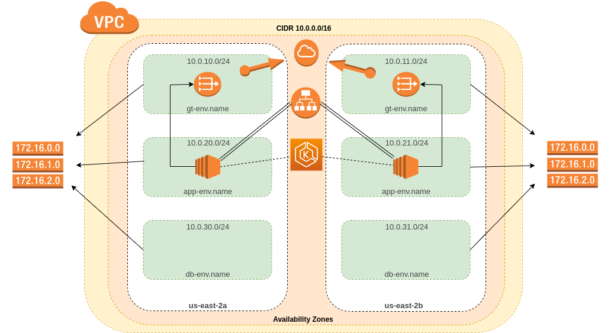
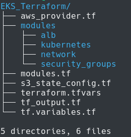
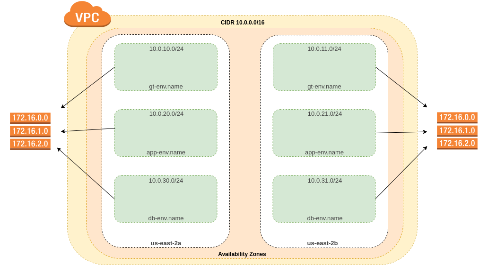

# EKS cluster with terraform

EKS is a kubernetes service for AWS. In this guide we are going to deploy an EKS cluster from zero.

## Target
The goal is create all required elements to deploy an EKS cluster. The next diagram shows a general description about this


We going to deploy one VPC with 2 availability zone and 3 subnets ("DB", "Applications", "gateway or public"). Then, over this, we will deploy eks master and one worker. This workers will be protected of internet with a nat gateway linked with internet gateway. Finally, we going to deploy Application Load Balancer

## Table of contents

* [Initial configuration](#initial_configuration)
* [Network](#network)
* [Security](#security)
* [kubernetes_elements](#kubernetes_elements)
* [Load_Balancer](#load_balancer)

## Initial configuration

**1.** Download all tools that we need. (kubectl, aws-cli, aws-iam-authenticator, jq, terraform)

**kubectl**
```
# Install kubectl on ubuntu
curl -LO https://storage.googleapis.com/kubernetes-release/release/`curl -s https://storage.googleapis.com/kubernetes-release/release/stable.txt`/bin/linux/amd64/kubectl
chmod +x ./kubectl
sudo mv ./kubectl /usr/local/bin/kubectl
kubectl version
```

**aws-cli**
```
pip3 install awscli --upgrade --user         # python3 and python3-pip are required 
aws-cli/1.16.299 Python/2.7.17 Linux/5.0.0-37-generic botocore/1.13.35
```

**aws-iam-authenticator**
```
curl -o aws-iam-authenticator https://amazon-eks.s3-us-west-2.amazonaws.com/1.14.6/2019-08-22/bin/linux/amd64/aws-iam-authenticator
curl -o aws-iam-authenticator.sha256 https://amazon-eks.s3-us-west-2.amazonaws.com/1.14.6/2019-08-22/bin/linux/amd64/aws-iam-authenticator.sha256
openssl sha1 -sha256 aws-iam-authenticator
chmod +x ./aws-iam-authenticator
mkdir -p $HOME/bin && cp ./aws-iam-authenticator $HOME/bin/aws-iam-authenticator && export PATH=$HOME/bin:$PATH
echo 'export PATH=$HOME/bin:$PATH' >> ~/.bashrc
source ~/.bashrc
```

**jq**
```
apt-get update
apt-get install jq -y
```

**Terraform**
```
mkdir -p /tmp/install_terraform
apt update && apt install wget unzip -y
wget -v https://releases.hashicorp.com/terraform/0.12.17/terraform_0.12.17_linux_amd64.zip --directory-prefix=/tmp/install_terraform
unzip /tmp/install_terraform/terraform_0.12.17_linux_amd64.zip -d /tmp/install_terraform/.
mv /tmp/install_terraform/terraform /usr/bin/.
rm -r /tmp/install_terraform
```

**2.** We have to configure one user with enough permissions for configure resources from aws cli, and create security credentials for it.
```
$ aws configure
AWS Access Key ID [None]: YOUR_ACCESS_KEY
AWS Secret Access Key [None]: YOUR_SECRET_KEY
Default region name [None]: YOUR_REGION
Default output format [None]: json
```
**Note:** You should use environment variables for configure those in terraform in the next steps.

**3.** Define workdir structure and create basic files, like the next tree



In this part we have to configure the modules folders and main files for the correct terraform configuration.

## Network


We have to abstract some diagram components. In this module, we only going to create a VPC, Subnets, Route Tables and gateways of the eks cluster.

For this resources, go to the network module folder [link to Network components!](modules/network)

## Security

We have to configure all permission for allow communication between:
* External machine and Kubernetes API
* Cluster nodes
* Nodes and API Server
* API Server and pods
* EKS master and worker kubelets

For this resources, go to the security_groups module folder [link to security_groups components!](modules/security_groups)

## Kubernetes_elements

We have to create next resources:

* Role for EKS master management.
* EKS master
* Role for workers
* Launch configuration
* Auto Scaling Group
* User data for ec2 instances
* ConfigMap to link role with kubernetes RBAC

For this resources, go to the kubernetes module folder [link to kubernetes components!](modules/kubernetes)

## Load_Balancer

For this module, we have to create the next resources:
* Target group for ec2-instances
* Application Load Balancer
* Listener to receive request from internet

**All ALB Security is declared into security_groups module**

For this resources, go to the Load_Balancer module folder [link to Load_Balancer components!](modules/alb)


